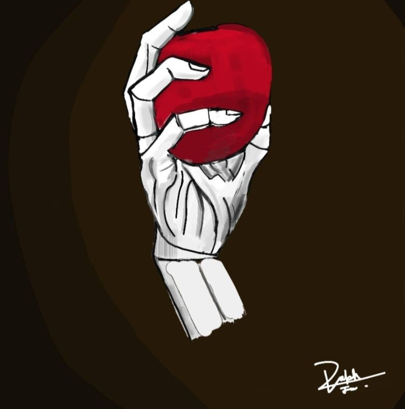
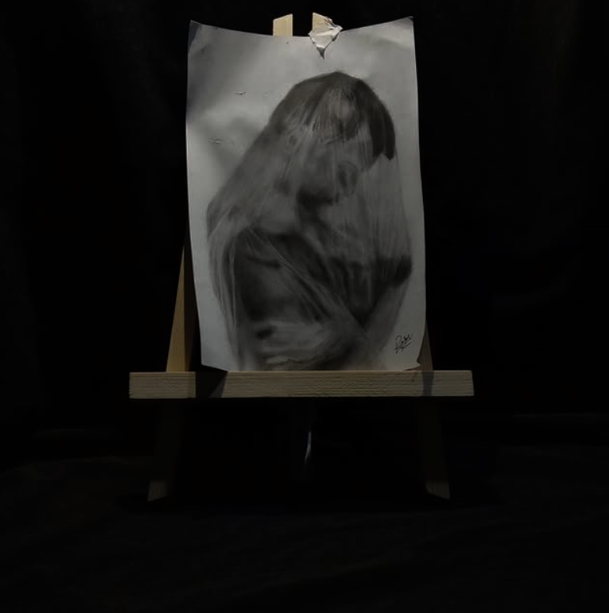
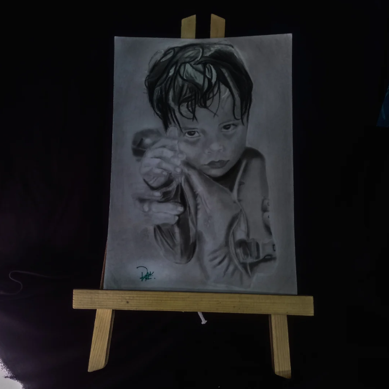
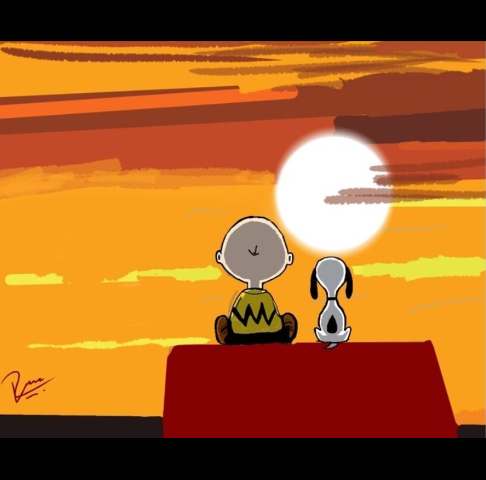
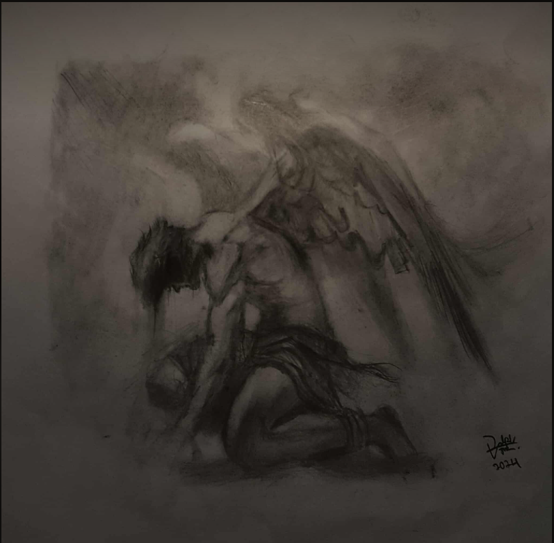
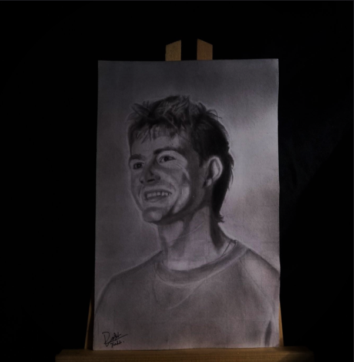
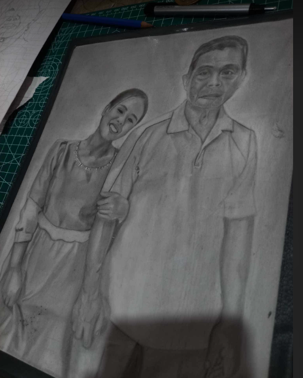

<!DOCTYPE html>
<html lang="en">
<head>
<meta charset="UTF-8">
<meta name="viewport" content="width=device-width, initial-scale=1.0">
<title>Autobiography - Ralph Tristhan B. Igot</title>

</head>
<body>

<header>
  <h1>My Autobiography</h1>
  <h3>by Ralph Tristhan B. Igot</h3>
</header>

<nav>
  <a href="#overview">Overview</a>
  <a href="#background">Background</a>
  <a href="#skills">Skills</a>
  <a href="#artworks">Artworks</a>
  <a href="#contact">Contact</a>
</nav>

<section id="overview">
  <h2>Overview</h2>
  
I’m <strong>Ralph Tristhan B. Igot</strong> from Lapu-Lapu City, Cebu, Philippines. I’m an art commissioner who makes traditional art like portraits and eye keychains. I study <strong>Information Technology</strong> at Lapu-Lapu City College. My course isn’t really related to art, but it doesn’t stop me from doing what I love. Art has always been my way to breathe and express things I can’t say.

</section>

<section id="background">
  <h2>Background</h2>
  
Since I was a kid, I’ve always liked to draw. It started as something I did when I was bored, but later, it became part of me. Growing up, life wasn’t always easy, and art became my escape. It’s where I find calm whenever things get heavy. Even now, while studying IT, I still hold on to that part of me the one that sees the world through sketches and shades.

  
  <table>
    <tr><th>Member</th><th>Relation</th></tr>
    <tr><td>Ralph Tristhan B. Igot</td><td>Myself</td></tr>
    <tr><td>Melvin A. Igot</td><td>Father</td></tr>
    <tr><td>Bonifacia B. Igot</td><td>Mother</td></tr>
  </table>
</section>

<section id="skills">
  <h2>My Skills & Interests</h2>
  
I’m skilled in portrait drawing, editing, and have a good sense of arts and anatomy. I also enjoy filmmaking, photography, and reading books. I love creative things that let me express stories or emotions. Someday, I want to travel not just to see places, but to feel moments that can turn into art.

  <ul>
    <li>Portrait Drawing & Art Commissions</li>
    <li>Photo & Video Editing</li>
    <li>Creative Writing & Storytelling</li>
    <li>Digital Marketing Basics</li>
  </ul>

  
Check out more of my artworks and commissions on my Instagram:  
    <a href="https://www.instagram.com/rlph_art/" target="_blank">@rlph_art</a>
  

</section>

<section id="artworks">
  <h2>My Artworks</h2>
  
Here are some areas where I can showcase my art and creative projects.

  

    

    

    

    

    

    

    

  

</section>

<section id="contact" class="contact-section">
  <h2>Contact Me</h2>
  

    
 <strong>Instagram:</strong> <a href="https://www.instagram.com/rlph_art/" target="_blank">instagram.com/rlph_art</a>

    
 <strong>Facebook:</strong> <a href="https://www.facebook.com/ralph.igot.43963/" target="_blank">facebook.com/ralph.igot.43963</a>

    
 <strong>TikTok:</strong> <a href="https://www.tiktok.com/@ralph.igot?is_from_webapp=1&sender_device=pc" target="_blank">tiktok.com/@ralph.igot</a>

    
 <strong>Phone:</strong> 0912-345-6789

  

</section>

<footer>
  
© 2025 Ralph Tristhan B. Igot | Visit 
    <a href="https://www.instagram.com/rlph_art/" target="_blank">@rlph_art</a>
  

</footer>

</body>
</html>
